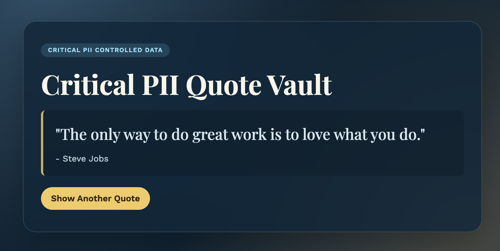
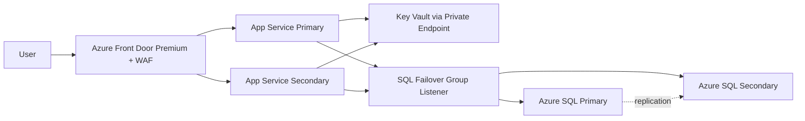

# Critical PII Random Quotes Web App (Azure + Terraform + Python)



This project provisions and deploys a **public** Python web application in Azure that fetches a random quote from **Azure SQL Database**. The design treats all data as **critical PII**, with network-private service connectivity, encryption controls, managed identities, and cross-region high availability.

## Demo URL

https://web-s-quotes-prod-nhxyaq-ejgpaudjhfbxfsff.westus3-01.azurewebsites.net/

## Critical PII Random Quotes Web App Architecture


## What this deploys

- Azure Front Door Premium with WAF (public entry point)
- Two regional Azure App Services (Linux/Python) for active-active availability
- Azure SQL Database (Business Critical) with cross-region Failover Group
- Azure Key Vault with private endpoints, storing SQL admin secret
- Private endpoints + private DNS for SQL and Key Vault
- User-assigned identities for SQL CMK/TDE integration
- Managed identities for App Services to fetch secrets from Key Vault
- Log Analytics + Application Insights
- Required governance tags on all taggable resources

## Architecture



## PII and security controls

- **Data classification tags** applied: `DataClassification=CriticalPII`
- **Encryption at rest**:
  - Azure SQL TDE enabled
  - Customer-managed key in Key Vault attached to SQL servers
  - Key Vault purge protection enabled
- **Network-private data plane**:
  - SQL public network disabled
  - Key Vault public network disabled
  - Private endpoints + private DNS zones for SQL and Key Vault
- **Managed identities**:
  - App Services use system-assigned MI to retrieve secrets from Key Vault
  - SQL servers use user-assigned MI for CMK/TDE key access
- **Perimeter protection**:
  - Front Door WAF in prevention mode
  - Rate limiting + managed rules
- **Transport security**:
  - HTTPS-only for app routing and Front Door forwarding
  - TLS minimums configured for SQL and web apps

## High availability design

- Active-active app tier in two Azure regions behind Front Door health probing
- SQL Database with automatic failover group across two SQL servers/regions
- Zonal SQL database configuration (`zone_redundant = true`)
- App Service plans configured for multiple workers

## Application behavior

- On startup/first request, the app creates `dbo.Quotes` if needed and **idempotently seeds** famous quotes.
- Each `/` request queries a random quote using `ORDER BY NEWID()`.
- `/healthz` provides health checks for Front Door probing.

## Repository layout

- `app/` Flask application + frontend
- `infra/` Terraform IaC
- `scripts/approve_frontdoor_private_link.sh` private-link approval helper
- `.azure/plan.md` implementation plan and validation status

## Prerequisites

- Terraform `>= 1.6`
- Azure CLI logged in with rights to create all listed resources
- For strict private-only mode, Terraform execution host must have private network reachability to Key Vault private endpoint(s)
  (for example: self-hosted runner in Azure VNet, or workstation connected via VPN/ExpressRoute)
- Subscription permission for:
  - Networking (VNets, private endpoints, DNS zones)
  - App Service
  - Front Door + WAF
  - Azure SQL + failover group
  - Key Vault and keys/secrets

## Step-by-step deployment

1. Set Azure context.

```bash
az login
az account set --subscription "<subscription-id-or-name>"
```

2. Prepare Terraform variables.

```bash
cd infra
cp terraform.tfvars.example terraform.tfvars
# edit terraform.tfvars for names/regions/tags as needed
```

Bootstrap tip for public/local runner (temporary):
- Set `web_app_public_network_access_enabled = true` for zip deployment to App Service.
- Set `key_vault_public_network_access_enabled = true` and `key_vault_allowed_ip_cidrs = ["<your-public-ip>/32"]`.
- After testing, lock down by setting `web_app_public_network_access_enabled = false`, `key_vault_public_network_access_enabled = false`, and `key_vault_allowed_ip_cidrs = []`.

3. Initialize and validate Terraform.

```bash
terraform init
terraform validate
```

4. Review and apply.

```bash
terraform plan -out tfplan
terraform apply tfplan
```

5. Approve Front Door private link connections to each web app origin.

```bash
# use values from Terraform outputs
terraform output resource_group_name
terraform output primary_web_app_name
terraform output secondary_web_app_name

../scripts/approve_frontdoor_private_link.sh <resource-group-name> <primary-web-app-name>
../scripts/approve_frontdoor_private_link.sh <resource-group-name> <secondary-web-app-name>
```

6. Get the public application URL.

```bash
terraform output frontdoor_url
```

7. Validate behavior.

```bash
curl -i "$(terraform output -raw frontdoor_url)/healthz"
curl -i "$(terraform output -raw frontdoor_url)/api/quote"
```

## SQL failover test (cross-region)

1. Confirm current primary.

```bash
az sql failover-group show \
  --name "$(terraform output -raw sql_failover_group_name)" \
  --resource-group "$(terraform output -raw resource_group_name)" \
  --server "$(terraform output -raw primary_sql_server_name)"
```

2. Trigger failover from current primary server.

```bash
az sql failover-group set-primary \
  --name "$(terraform output -raw sql_failover_group_name)" \
  --resource-group "$(terraform output -raw resource_group_name)" \
  --server "$(terraform output -raw primary_sql_server_name)" \
  --partner-server "$(terraform output -raw secondary_sql_server_name)"
```

3. Re-test app endpoint (`/api/quote`) and verify continued success.

## Local validation performed in this workspace

- `terraform fmt -recursive`
- `terraform validate`
- `PYTHONPYCACHEPREFIX=.pycache python3 -m py_compile app/*.py`

## AI usage disclosure

AI tooling (Chat GPT) was used to:
- Generate Flask app structure, DB seed logic, and frontend templates
- Draft deployment documentation and runbook commands

Manual engineering review and iterative fixes were applied afterward.

## Cleanup

```bash
cd infra
terraform destroy
```
